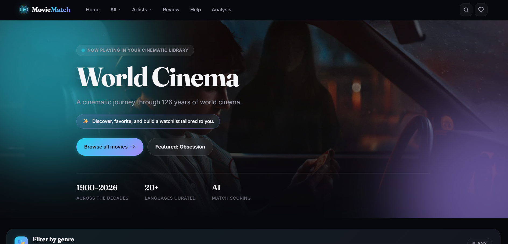
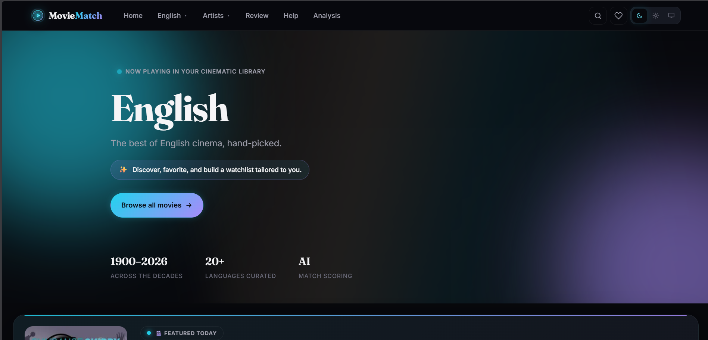
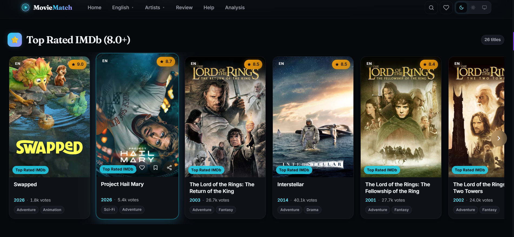
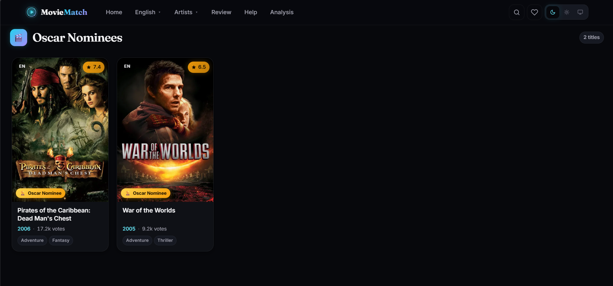
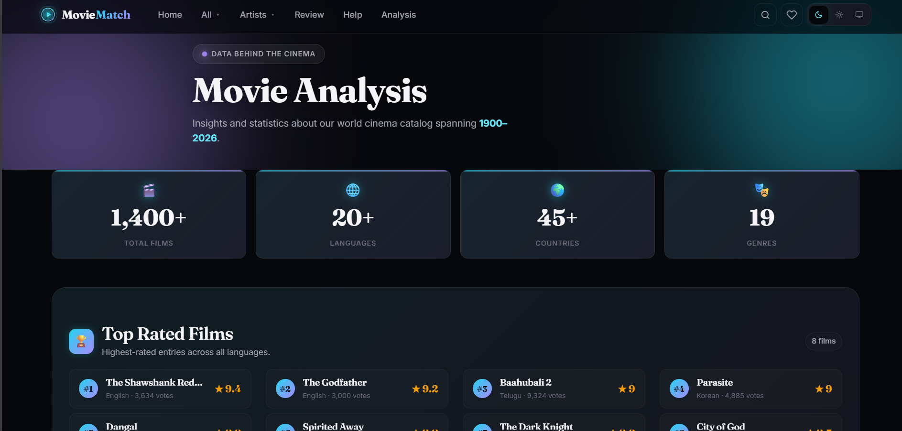
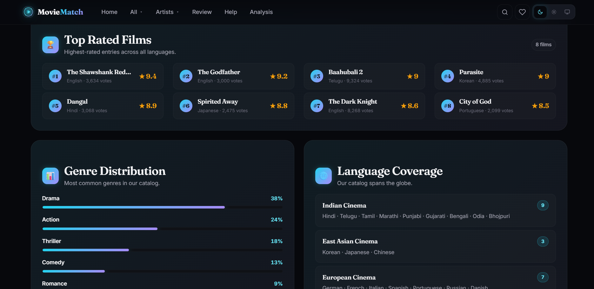
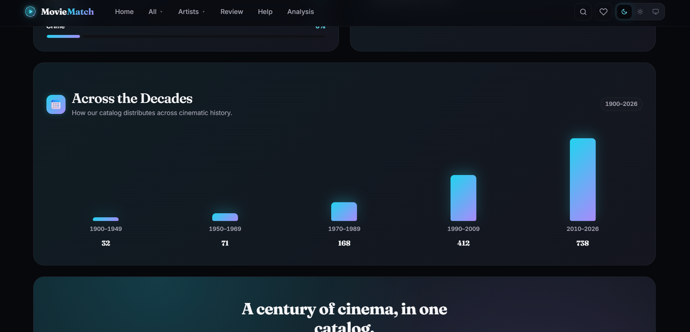
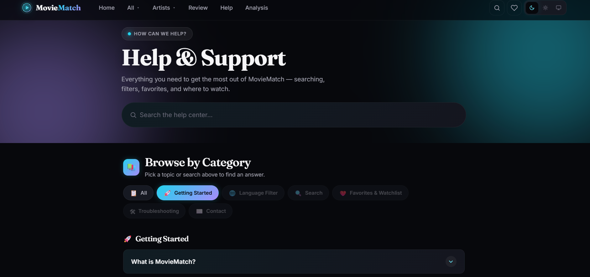
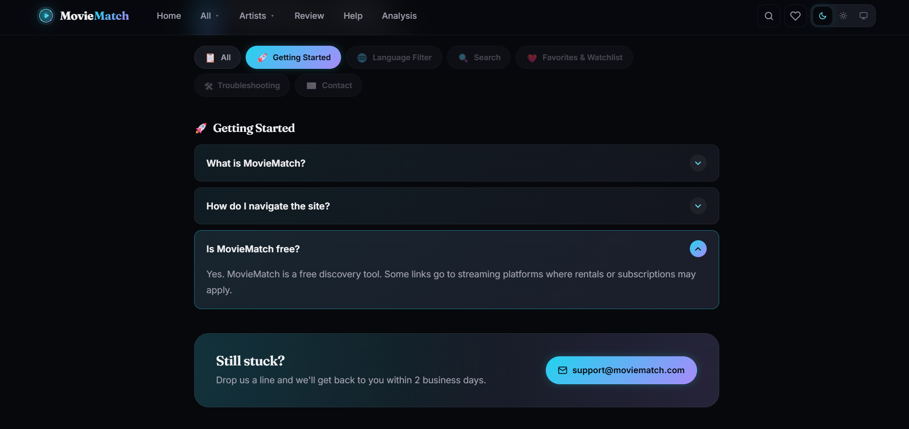

# 🎬 MovieMatch

<div align="center">

### AI-Powered Movie Discovery & Recommendation Platform

Discover trending movies, explore detailed insights, browse artists, analyze ratings, save favorites, and enjoy a modern cinematic experience powered by the TMDB API.

<br>

[](https://movie-match-five-xi.vercel.app/)
[](https://github.com/saisharatkaruturi/MovieMatch)


</div>

---

# 🌐 Live Website

### 🚀 https://movie-match-five-xi.vercel.app/

---

# 📖 Overview

MovieMatch is a modern AI-inspired movie discovery platform developed using **React**, **Vite**, and the **TMDB API**.

The platform enables users to discover trending movies, search thousands of films, explore detailed movie information, browse actor profiles, analyze ratings, and save favorite movies through a fast, responsive, and visually engaging interface.

Built with performance, scalability, and user experience in mind, MovieMatch demonstrates modern frontend development practices including reusable components, API integration, responsive UI, and optimized application architecture.

---

# ✨ Features

## 🎥 Movie Discovery

- Trending Movies
- Popular Movies
- Top Rated Movies
- Upcoming Releases
- Featured Hero Banner

---

## 🔍 Smart Search

- Instant Movie Search
- Debounced Search
- Genre Filtering
- Dynamic Search Results

---

## 🎬 Detailed Movie Information

- Movie Overview
- Posters
- Backdrops
- Release Date
- Runtime
- Genres
- Spoken Languages
- Production Companies
- IMDb Rating
- TMDB Rating
- Popularity Metrics

---

## 🎭 Artist Explorer

- Actor Profiles
- Biography
- Known For Movies
- Cast Information
- Profile Images

---

## 📊 Analytics Dashboard

- Rating Analysis
- Vote Statistics
- Popularity Metrics
- Runtime Information
- Release Insights

---

## ❤️ Favorites

- Save Favorite Movies
- Personal Collection
- Quick Access Dashboard

---

## 📺 Watch Information

- Streaming Availability
- Watch Providers
- Platform Information

---

## 🎨 Modern UI/UX

- Dark Theme
- Responsive Design
- Smooth Animations
- Skeleton Loading
- Toast Notifications
- Reusable Components
- Mobile Friendly

---

# 🖼️ Project Gallery

## 🏠 Dashboard

| Dashboard | Dashboard |
|-----------|-----------|
|  |  |

| Dashboard | Dashboard |
|-----------|-----------|
|  |  |

---

## 🎬 English Movies

| | |
|---|---|
|  |  |

| | |
|---|---|
|  |  |

| | |
|---|---|
|  |  |

---

## 🎥 Hindi Movies

| | |
|---|---|
|  |  |

| | |
|---|---|
|  |  |

| | |
|---|---|
|  |  |

---

## 🎞️ Telugu Movies

| | |
|---|---|
|  |  |

| | |
|---|---|
|  |  |

| | |
|---|---|
|  |  |

| |
|---|
|  |

---

## 🎭 Artist Database

| | |
|---|---|
|  |  |

| | |
|---|---|
|  |  |

---

## ⭐ Reviews

| | |
|---|---|
|  |  |

---

## 📈 Analytics

| | |
|---|---|
|  |  |

| | |
|---|---|
|  |  |

| |
|---|
|  |

---

## ❓ Help

| | |
|---|---|
|  |  |

---

# 🛠️ Tech Stack

### Frontend

- React
- JavaScript (ES6+)
- Vite
- CSS3

### API

- TMDB API

### State Management

- React Context API
- Custom Hooks

### UI Components

- Responsive Layout
- Theme Toggle
- Skeleton Loading
- Toast Notifications
- Reusable Components

---

# 📂 Project Structure

```
MovieMatch
│
├── public
├── Screenshots-moviematch
├── src
│   ├── components
│   ├── context
│   ├── hooks
│   ├── pages
│   ├── services
│   ├── utils
│   └── assets
│
├── package.json
├── vite.config.js
└── README.md
```

---

# 🚀 Installation

Clone the repository

```bash
git clone https://github.com/saisharatkaruturi/MovieMatch.git
```

Navigate into the project

```bash
cd MovieMatch
```

Install dependencies

```bash
npm install
```

Start development server

```bash
npm run dev
```

Build for production

```bash
npm run build
```

---

# 🌐 API Integration

MovieMatch uses the **TMDB (The Movie Database) API** to provide:

- Trending Movies
- Popular Movies
- Top Rated Movies
- Upcoming Movies
- Movie Search
- Genres
- Cast Information
- Ratings
- Reviews
- Movie Metadata

---

# 🚀 Future Enhancements

- 🤖 AI Personalized Recommendations
- 🎙️ Voice Search
- 🎬 Movie Trailers
- 👤 User Authentication
- ⭐ Watchlists
- 💬 Community Reviews
- 🎯 AI Recommendation Engine
- 📱 Progressive Web App (PWA)
- 🔔 Notifications
- 🎥 OTT Platform Integration

---

# 🤝 Contributing

Contributions are welcome.

1. Fork the repository
2. Create a feature branch
3. Commit your changes
4. Push your branch
5. Open a Pull Request

---

# 📄 License

This project is intended for **educational**, **portfolio**, and **learning** purposes.

---

# 👨‍💻 Developer

**Sai Sharat Karuturi**

🌐 Live Demo  
https://movie-match-five-xi.vercel.app/

💻 GitHub  
https://github.com/saisharatkaruturi/MovieMatch

---

<div align="center">

### ⭐ If you like this project, consider giving it a Star!

Made with ❤️ by **Sai Sharat Karuturi**

</div>
